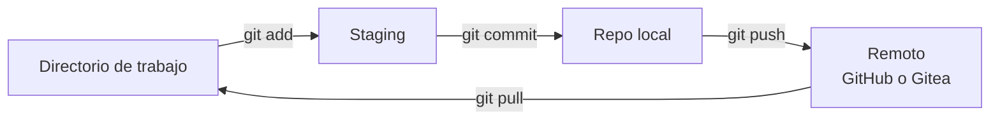
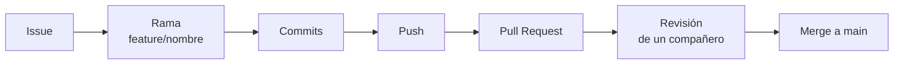
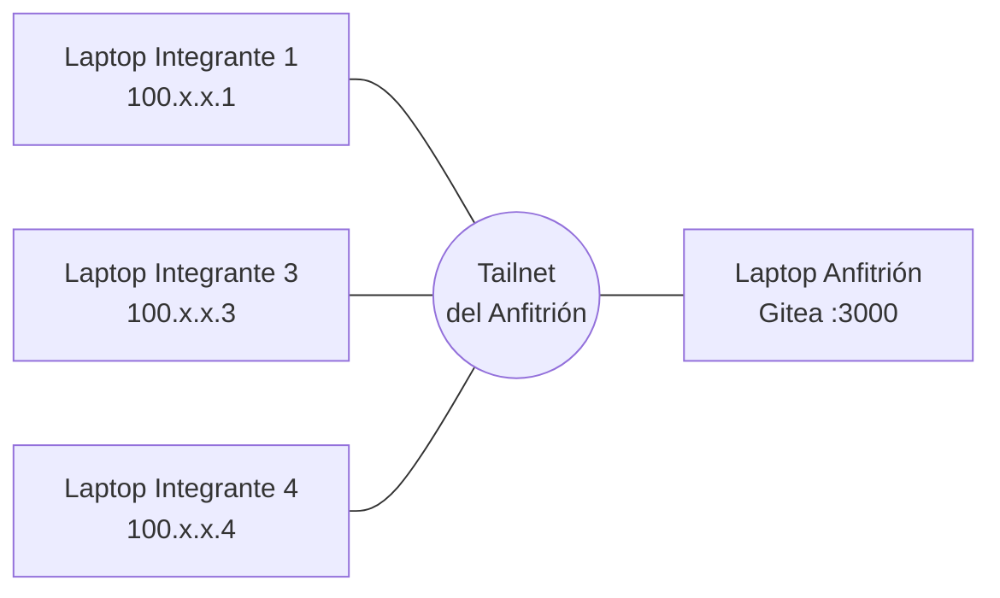

# Guía práctica: Git, GitHub, Tailscale y Gitea en equipos de 4

## 1. Objetivos y organización del equipo

Al terminar la práctica, cada equipo de 4 habrá construido un mismo proyecto dos veces: primero colaborando en GitHub (nube pública) y luego en un servidor Gitea propio, alojado en la máquina de un compañero y accesible solo por la red privada de Tailscale.

**Resultados de aprendizaje**

- Explicar para qué sirven Git, GitHub, Tailscale y Gitea, y en qué se diferencian.
- Usar el ciclo básico de Git: `clone`, `add`, `commit`, `push`, `pull`.
- Trabajar con ramas y *Pull Requests*, incluida la revisión de código entre compañeros.
- Detectar y resolver un conflicto de *merge*.
- Montar un servidor Git privado y conectarse a él de forma segura sin abrir puertos en el router.

**Duración sugerida:** 2 sesiones de 2 horas (Sesión 1: Parte A; Sesión 2: Partes B, C y D).

**Proyecto de trabajo:** una mini web estática "Página del equipo" (`index.html` + un archivo por integrante). Es simple a propósito: el foco es Git, no el código.

**Roles** (se rotan si hay una segunda práctica)

| Rol | Responsabilidad en GitHub (Parte A) | Responsabilidad en Gitea (Partes B–D) |
| --- | --- | --- |
| Integrante 1 — Líder / Integrador | Crea el repositorio, protege la rama `main`, aprueba y fusiona los PR | Crea la organización y el repositorio en Gitea |
| Integrante 2 — Anfitrión del servidor | Desarrolla su sección | Instala Tailscale + Gitea en su máquina y comparte el acceso |
| Integrante 3 — Desarrollador / Revisor | Desarrolla su sección y revisa PR ajenos | Verifica que la historia de GitHub llegó a Gitea |
| Integrante 4 — Desarrollador / Documentador | Desarrolla su sección y mantiene el `README.md` | Documenta la instalación con capturas para la entrega |

## 2. Conceptos: ¿para qué sirve cada herramienta?

Git guarda la historia del código en tu máquina; GitHub y Gitea son "servidores" donde el equipo comparte esa historia; Tailscale es la red privada que permite llegar al servidor de un compañero desde cualquier lugar.

| Herramienta | Qué es | Para qué sirve en la práctica | Analogía |
| --- | --- | --- | --- |
| **Git** | Sistema de control de versiones distribuido, instalado en cada computadora | Guardar "fotos" (commits) del proyecto, volver atrás, trabajar en ramas sin romper lo que funciona | El historial de versiones de un documento, pero para todo el proyecto |
| **GitHub** | Servicio en la nube que aloja repositorios Git | Compartir el repositorio, revisar código con Pull Requests, gestionar tareas (Issues) | Google Drive para código, con revisión entre pares |
| **Tailscale** | VPN tipo *mesh* basada en WireGuard | Que las 4 laptops se vean como si estuvieran en la misma red local, aunque estén en casas distintas, sin abrir puertos | Un cable de red virtual y cifrado entre los compañeros |
| **Gitea** | Servidor Git ligero y de código abierto (auto-hospedado) | Tener "nuestro propio GitHub" en una máquina del equipo o de la institución | Un GitHub casero |

**Vocabulario mínimo**

- **Repositorio (repo):** carpeta del proyecto + su historia completa (la carpeta oculta `.git`).
- **Commit:** una foto del proyecto con un mensaje que explica el cambio.
- **Rama (branch):** una línea de trabajo paralela. `main` es la rama estable.
- **Remoto (remote):** la copia del repo en un servidor. Por convención se llama `origin`.
- **Push / Pull:** enviar tus commits al remoto / traer los commits de los demás.
- **Pull Request (PR):** solicitud para fusionar una rama en `main`, con revisión de un compañero.
- **Conflicto:** dos personas cambiaron las mismas líneas; Git pide que un humano decida.

**¿Por qué aprender también Gitea?** Muchas empresas e instituciones públicas no pueden subir su código a la nube por confidencialidad. Git funciona igual con cualquier servidor: los comandos que aprendan en GitHub sirven tal cual en Gitea, GitLab o Bitbucket.



El diagrama muestra el recorrido de un cambio: se prepara (`add`), se guarda localmente (`commit`) y se comparte (`push`); los compañeros lo reciben con `pull`.

## 3. Preparación del entorno (los 4 integrantes)

Cada integrante necesita Git instalado, una cuenta de GitHub y su identidad configurada.

| Quién | Instalar | Verificar con |
| --- | --- | --- |
| Todos | Git ([git-scm.com](https://git-scm.com/downloads)) | `git --version` |
| Todos | Cuenta en [GitHub](https://github.com) | Iniciar sesión en el navegador |
| Todos | Editor: VS Code (recomendado) | Abrir una carpeta |
| Todos | Tailscale ([tailscale.com/download](https://tailscale.com/download)) — se usa en la Parte B | Icono de Tailscale en la barra |
| Anfitrión | Nada extra: Gitea se descarga en la Parte C | — |

**Configurar la identidad** (una sola vez por computadora):

```bash
git config --global user.name "Nombre Apellido"
git config --global user.email "correo@ejemplo.com"   # el mismo de GitHub
git config --global init.defaultBranch main
git config --global core.editor "code --wait"         # opcional: VS Code como editor
git config --list                                     # comprobar
```

**Autenticación con GitHub:** GitHub ya no acepta la contraseña de la cuenta en la terminal. Opciones, de más fácil a más técnica:

1. **GitHub CLI:** instalar `gh` y ejecutar `gh auth login` (elige HTTPS y el navegador).
2. **Token personal (PAT):** GitHub → Settings → Developer settings → Personal access tokens. Se pega como contraseña cuando `git push` la pida.
3. **Llave SSH:**

   ```bash
   ssh-keygen -t ed25519 -C "correo@ejemplo.com"
   cat ~/.ssh/id_ed25519.pub   # copiar y pegar en GitHub → Settings → SSH and GPG keys
   ssh -T git@github.com       # prueba
   ```

**Checkpoint 0:** los 4 muestran al docente la salida de `git --version` y `git config user.email`.

## 4. Parte A — Flujo colaborativo en GitHub

El equipo trabaja con el flujo "una rama por tarea + Pull Request revisado", que es el que usan la mayoría de equipos profesionales.



### A1. El Líder crea el repositorio (10 min)

1. GitHub → **New repository** → nombre `pagina-equipo-N` (N = número de equipo), marcar **Add a README**, licencia MIT, `.gitignore` opcional.
2. **Settings → Collaborators → Add people:** invitar a los otros 3 (deben aceptar la invitación desde su correo).
3. **Settings → Branches → Add branch protection rule** (o *Rulesets*) sobre `main`: exigir Pull Request y 1 aprobación. Así nadie puede hacer `push` directo a `main`.
4. Crear 4 **Issues**, uno por integrante: "Crear sección de \<nombre>", y asignar cada uno a su dueño.

### A2. Todos clonan (5 min)

```bash
git clone https://github.com/USUARIO-LIDER/pagina-equipo-N.git
cd pagina-equipo-N
git remote -v        # debe mostrar origin → github.com
```

### A3. El Líder crea la base (10 min)

El Líder crea `index.html` en una rama propia y lo fusiona mediante PR (aunque sea él mismo, otro integrante debe aprobarlo):

```bash
git switch -c feature/base
# crear index.html con un <h1> y una lista <ul id="integrantes"></ul>
git add index.html
git commit -m "Agrega estructura base de la página"
git push -u origin feature/base
```

En GitHub aparece el botón **Compare & pull request**. En la descripción escribir `Closes #1` para cerrar el Issue automáticamente.

### A4. Cada integrante trabaja en su rama (20 min)

```bash
git switch main
git pull                              # traer la base
git switch -c feature/seccion-ana     # usar tu nombre
# crear ana.html con: nombre, carrera, un hobby y una foto o emoji
# agregar en index.html una línea <li><a href="ana.html">Ana</a></li>
git add .
git commit -m "Agrega sección de Ana"
git push -u origin feature/seccion-ana
```

Buenas prácticas que el docente revisará:

- Commits pequeños, con mensajes en imperativo que explican *qué* y *por qué*.
- Revisar siempre `git status` y `git diff` antes de `git add`.
- Nunca subir contraseñas, `.env` ni carpetas como `node_modules`.

### A5. Revisión de código cruzada (15 min)

Cada PR lo revisa un compañero distinto (1→2, 2→3, 3→4, 4→1). El revisor entra a **Files changed**, deja al menos **un comentario en una línea** y luego **Approve**. El autor atiende el comentario con un nuevo commit en la misma rama (el PR se actualiza solo). El Líder fusiona con **Merge pull request**.

### A6. Provocar y resolver un conflicto (20 min)

Este es el ejercicio más importante: los conflictos asustan hasta que se resuelve el primero.

1. Integrantes 3 y 4 crean ramas desde el mismo `main` y **editan la misma línea** del `<h1>` en `index.html` con textos distintos.
2. Integrante 3 abre su PR y se fusiona primero.
3. El PR del Integrante 4 muestra *This branch has conflicts*. Lo resuelve localmente:

```bash
git switch feature/titulo-4
git pull origin main          # Git marca el conflicto
# abrir index.html: ver los marcadores <<<<<<< ======= >>>>>>>
# dejar la versión acordada por ambos y borrar los marcadores
git add index.html
git commit -m "Resuelve conflicto en el título"
git push
```

4. El PR queda listo para fusionarse. Todos hacen `git switch main && git pull`.

### A7. Ver la historia (5 min)

```bash
git log --oneline --graph --all
```

**Checkpoint A:** 4 PR fusionados, 1 conflicto resuelto, 4 Issues cerrados y el gráfico de `git log` con las ramas visibles. Opcional: activar **GitHub Pages** (Settings → Pages → rama `main`) para publicar la página.

## 5. Parte B — Red privada con Tailscale

Tailscale da a cada laptop una IP privada fija (rango `100.x.y.z`) y cifra el tráfico entre ellas; así los 4 integrantes pueden llegar al servidor Gitea del Anfitrión desde la universidad o desde casa, sin configurar el router ni exponer nada a Internet.

**¿Por qué no simplemente usar la IP del Wi-Fi?** Porque cambia según la red, las redes universitarias suelen aislar a los clientes entre sí y desde casa no hay forma de llegar sin abrir puertos (inseguro). Tailscale resuelve los tres problemas.



### B1. El Anfitrión crea la red (tailnet) — 10 min

1. Entrar a [login.tailscale.com](https://login.tailscale.com) con su cuenta de Google, Microsoft o GitHub. Se crea automáticamente su *tailnet* con el plan gratuito Personal (hasta 6 usuarios, dispositivos ilimitados según la [página de precios](https://tailscale.com/pricing)).
2. Instalar Tailscale en su laptop e iniciar sesión. En Linux:

   ```bash
   curl -fsSL https://tailscale.com/install.sh | sh
   sudo tailscale up
   ```

3. Anotar su IP de Tailscale: `tailscale ip -4` (ejemplo: `100.101.102.103`).
4. En la consola web: **Users → Invite users** e invitar a los correos de los otros 3 integrantes.

### B2. Los demás se unen — 10 min

1. Aceptar la invitación del correo (entran a la tailnet del Anfitrión, no a una propia).
2. Instalar Tailscale e iniciar sesión con **esa misma cuenta invitada**.
3. Verificar que todos aparecen: `tailscale status`.

### B3. Probar la conectividad — 5 min

```bash
tailscale status                    # lista de equipos de la tailnet
tailscale ping 100.101.102.103      # IP del Anfitrión
ping 100.101.102.103
```

Si la tailnet tiene **MagicDNS** activado (Settings → DNS, viene activo por defecto), también se puede usar el nombre del equipo, p. ej. `ping laptop-anfitrion`.

**Seguridad:** solo los invitados ven los equipos de la tailnet. Al terminar el curso, el Anfitrión elimina a los usuarios desde la consola.

**Checkpoint B:** captura de `tailscale status` mostrando los 4 equipos y un `ping` exitoso hacia el Anfitrión.

## 6. Parte C — El Anfitrión levanta Gitea

Gitea es un solo archivo: se descarga, se ejecuta y se configura desde el navegador, como cualquier aplicación. Mientras la ventana de Gitea esté abierta, el servidor está encendido; si se cierra, el servidor se apaga.

### C1. Descargar Gitea — 5 min

1. Entrar a [dl.gitea.com/gitea](https://dl.gitea.com/gitea/) y abrir la carpeta de la versión más reciente.
2. Descargar el archivo que corresponde al sistema operativo:

| Sistema | Archivo a descargar (termina en…) | Renombrar a |
| --- | --- | --- |
| Windows | `windows-4.0-amd64.exe` | `gitea.exe` |
| macOS (chip M1/M2/M3/M4) | `darwin-10.12-arm64` | `gitea` |
| macOS (Intel) | `darwin-10.12-amd64` | `gitea` |
| Linux | `linux-amd64` | `gitea` |

3. Crear una carpeta `gitea` en Documentos y mover allí el archivo renombrado.

### C2. Encender el servidor — 5 min

Abrir una terminal dentro de la carpeta `gitea` y ejecutar:

- **Windows:** en el Explorador, clic en la barra de direcciones de la carpeta, escribir `cmd` y Enter. Luego: `gitea.exe web`
- **macOS / Linux:** `chmod +x gitea` (solo la primera vez) y luego `./gitea web`

En macOS, si aparece "no se puede abrir porque es de un desarrollador no identificado": Ajustes del Sistema → Privacidad y seguridad → **Abrir igualmente**. En Windows, si el firewall pregunta, marcar **Redes privadas** y permitir.

La terminal mostrará mensajes y se quedará abierta: eso significa que el servidor está funcionando. No cerrarla.

### C3. Configurar desde el navegador — 10 min

1. En la laptop del Anfitrión abrir `http://localhost:3000`.
2. En la pantalla **Configuración inicial** cambiar solo esto:
   - **Tipo de base de datos:** SQLite3.
   - **Dominio del servidor:** la IP de Tailscale del Anfitrión (ej. `100.101.102.103`).
   - **URL base de Gitea:** `http://100.101.102.103:3000/`
   - **Cuenta de administrador:** crear usuario y contraseña del Anfitrión.
3. Pulsar **Instalar Gitea**. Todo lo demás se deja por defecto.

### C4. Cuentas y repositorio del equipo — 10 min

1. Los otros 3 integrantes abren `http://100.101.102.103:3000` desde **su propia laptop** y pulsan **Registrarse**. (Si abre, la red Tailscale funciona.)
2. El Líder crea una organización `equipo-N` (**+ → Nueva organización**) y agrega a los 4 integrantes con permiso de escritura.
3. El Líder crea dentro de la organización un repositorio **vacío** llamado `pagina-equipo-N` (sin README). En la Parte D se llenará con el proyecto que ya existe en GitHub.

**Explica con tus palabras (para el informe):** ¿qué pasó al cerrar la terminal de Gitea? ¿Por qué los compañeros escriben la IP `100.x.x.x` y no `localhost`?

**Checkpoint C:** cada integrante inicia sesión en Gitea desde su laptop y ve el repositorio vacío de su organización.

## 7. Parte D — El equipo trabaja contra Gitea

Los comandos de Git son exactamente los mismos que en GitHub; lo único que cambia es la dirección del remoto. Esa es la lección central de la práctica.

### D1. Conectar el repositorio local a Gitea — 5 min

Primero el **Líder** sube el proyecto que ya tiene de GitHub al repositorio vacío de Gitea. Con un solo `push` viaja toda la historia de commits:

```bash
git remote add gitea http://100.101.102.103:3000/equipo-N/pagina-equipo-N.git
git push gitea main
```

Luego **los otros 3** conectan su carpeta al mismo servidor:

```bash
git remote add gitea http://100.101.102.103:3000/equipo-N/pagina-equipo-N.git
git remote -v            # ahora hay dos: origin (GitHub) y gitea
git pull gitea main
```

Al hacer `push` o `pull`, Git pide el usuario y la contraseña **de Gitea** (no los de GitHub).

**Explica con tus palabras:** abre en Gitea la pestaña *Commits*. ¿Por qué aparecen los commits que hicieron en GitHub si nadie los volvió a escribir?

### D2. Nuevo ciclo de trabajo en Gitea — 30 min

1. El Líder protege `main` en Gitea: **Settings del repo → Branches → Add protection**, exigiendo 1 aprobación.
2. El Líder crea 4 Issues en Gitea: "Agregar sección *Proyectos favoritos* a \<nombre>.html".
3. Cada integrante:

   ```bash
   git switch main
   git pull gitea main
   git switch -c feature/proyectos-ana
   # editar ana.html
   git add ana.html
   git commit -m "Agrega proyectos favoritos de Ana (#1)"
   git push -u gitea feature/proyectos-ana
   ```

4. En Gitea: **New Pull Request** hacia `main`, revisión cruzada igual que en A5, y merge por el Líder.

### D3. Mantener los dos remotos sincronizados (opcional) — 10 min

Si el equipo quiere que GitHub refleje lo hecho en Gitea:

```bash
git switch main
git pull gitea main
git push origin main
```

### D4. Prueba de desconexión — 5 min

El Anfitrión cierra la ventana de Gitea (o pulsa Ctrl+C en ella). Los demás intentan `git pull gitea main` y observan el error. Luego hacen commits en su laptop: **Git sigue funcionando sin servidor**, porque cada copia tiene la historia completa. Cuando el Anfitrión vuelve a ejecutar `gitea web`, hacen `push` sin perder nada.

**Pregunta de reflexión para el informe:** ¿qué ventajas y riesgos tiene alojar el código en la laptop de un compañero frente a GitHub? (disponibilidad, respaldos, privacidad, costo).

**Checkpoint D:** 4 PR fusionados en Gitea, `git remote -v` con dos remotos, y el grafo de commits visible en Gitea (pestaña *Commits* → *Graph*).

## 8. Entregables y rúbrica

Cada equipo entrega un informe PDF breve (máximo 6 páginas) con las capturas de los checkpoints, el enlace al repositorio de GitHub y la respuesta a la pregunta de reflexión.

**Contenido del informe**

- [ ] Tabla de roles con nombres reales.
- [ ] Captura del grafo `git log --oneline --graph --all` (Parte A).
- [ ] Captura del PR con el conflicto resuelto y su comentario de revisión.
- [ ] Captura de la app de Tailscale con los 4 equipos conectados (Parte B).
- [ ] Captura de Gitea con los commits traídos de GitHub y los PR fusionados (Partes C y D).
- [ ] Respuestas a las preguntas de comprensión (abajo).

**Preguntas de comprensión** (cada integrante responde al menos una, con sus palabras, 3–5 líneas):

1. ¿Qué diferencia hay entre Git y GitHub? ¿Y entre GitHub y Gitea?
2. ¿Para qué sirve una rama y por qué no trabajamos directo en `main`?
3. ¿Qué es un conflicto, por qué ocurrió en su equipo y cómo lo resolvieron?
4. ¿Qué problema resolvió Tailscale? ¿Qué pasaría sin él si cada uno está en su casa?
5. ¿Por qué pudieron seguir haciendo commits cuando el servidor Gitea estaba apagado?
6. ¿Cuándo conviene un servidor propio (Gitea) en lugar de GitHub? Dé un ejemplo real.

**Rúbrica (10 puntos)**

| Criterio | Excelente | Suficiente | Insuficiente |
| --- | --- | --- | --- |
| Flujo con ramas y PR en GitHub (2 pts) | 4 PR revisados con comentarios y fusionados; `main` protegida | PR fusionados sin revisión real | Commits directos a `main` |
| Resolución de conflicto (1.5 pts) | Conflicto resuelto y explicado | Resuelto sin explicación | No se resolvió |
| Participación (1 pt) | Los 4 integrantes tienen commits con mensajes claros | Mensajes genéricos ("cambios") | Un solo integrante hizo los commits |
| Tailscale + Gitea funcionando (2 pts) | Los 4 conectados e iniciando sesión en Gitea | Solo algunos acceden | No funcionó |
| Trabajo en Gitea (1.5 pts) | Historia traída de GitHub y 4 PR fusionados en Gitea | Menos de 4 PR | Sin trabajo en Gitea |
| Comprensión (2 pts) | Respuestas propias, correctas y con ejemplos de su práctica | Respuestas correctas pero copiadas o genéricas | Respuestas incorrectas o ausentes |

El docente puede verificar la participación individual en **Insights → Contributors** de GitHub y en la pestaña de actividad de Gitea.

## 9. Chuleta de comandos y solución de problemas

**Comandos esenciales**

| Comando | Para qué sirve |
| --- | --- |
| `git status` | Ver qué archivos cambiaron y qué está preparado |
| `git diff` | Ver las líneas exactas que cambiaron |
| `git add <archivo>` / `git add .` | Preparar cambios para el commit |
| `git commit -m "mensaje"` | Guardar una foto del proyecto |
| `git switch -c <rama>` | Crear una rama y moverse a ella |
| `git switch <rama>` | Cambiar de rama |
| `git push -u origin <rama>` | Subir una rama nueva por primera vez |
| `git pull` | Traer y fusionar cambios del remoto |
| `git log --oneline --graph --all` | Ver la historia como grafo |
| `git remote -v` / `git remote add <nombre> <url>` | Ver / agregar remotos |
| `git restore <archivo>` | Descartar cambios no guardados de un archivo |
| `git merge --abort` | Cancelar un merge con conflictos y volver atrás |
| `gitea web` (Windows: `gitea.exe web`) | Encender el servidor Gitea; Ctrl+C lo apaga |

**Problemas frecuentes**

| Síntoma | Causa probable | Solución |
| --- | --- | --- |
| `Authentication failed` al hacer push a GitHub | Se usó la contraseña de la cuenta | Usar `gh auth login`, un token (PAT) o SSH |
| `rejected ... (fetch first)` | El remoto tiene commits que no tienes | `git pull` y luego `git push` |
| `protected branch` al hacer push a `main` | La rama está protegida (es lo esperado) | Trabajar en una rama y abrir un PR |
| Git abre un editor raro (Vim) en el merge | Editor por defecto | Escribir `:wq` y Enter, o configurar `core.editor` |
| `Permission denied` al hacer push | No aceptaste la invitación de colaborador | Revisar el correo o github.com/notifications |
| No se abre `http://100.x.x.x:3000` | Tailscale desconectado, o la ventana de Gitea se cerró | Revisar el icono de Tailscale en ambas laptops y que la terminal de Gitea siga abierta |
| Los enlaces de clonar en Gitea dicen `localhost` | En la configuración inicial se dejó `localhost` como dominio | Editar `custom/conf/app.ini` (líneas `DOMAIN` y `ROOT_URL`) con la IP de Tailscale y reiniciar Gitea |
| Windows bloquea el puerto 3000 | Firewall de Windows | Permitir Gitea en redes privadas |
| macOS no deja abrir Gitea | Programa sin firma de Apple | Ajustes → Privacidad y seguridad → Abrir igualmente |
| La laptop del Anfitrión se suspende | Ahorro de energía | Desactivar suspensión durante la sesión y conectar el cargador |

**Recursos:** [Pro Git (libro gratuito en español)](https://git-scm.com/book/es/v2) · [Instalar Gitea desde binario](https://docs.gitea.com/installation/install-from-binary) · [Documentación de Tailscale](https://tailscale.com/kb) · [Juego interactivo de ramas](https://learngitbranching.js.org/?locale=es_ES)
